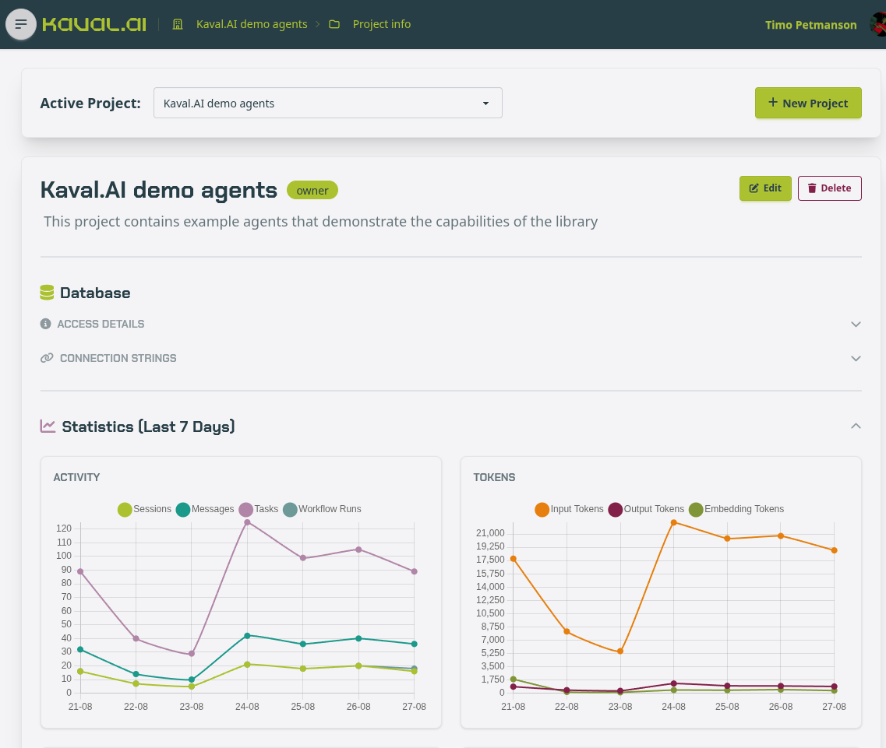

.. image:: _static/iconlogo.svg
   :width: 300
   :align: left
   :alt: Kaval.AI

|

**Kaval.AI is an opinionated Python library for building production-grade
agentic workflows, chatbots and tools.**

Every input, output and intermediate step is a validated `Pydantic
<https://docs.pydantic.dev/latest/>`__ model, every run is recorded and
open to inspection, and every provider is reached through a single small
asynchronous interface. The result is agentic software that can be debugged,
tested and operated under production conditions.

.. code-block:: bash

   pip install "kavalai[common]"

Features
--------

* **Every provider behind one interface** — OpenAI, Google Gemini, Anthropic
  and Ollama, selected by a ``provider/model`` string
  (see :doc:`tutorials/llm_clients`).
* **Structured inputs, outputs, tool calls and responses**, expressed with
  Pydantic semantics and validated at every boundary
  (see :doc:`tutorials/quickstart`).
* **A complete workflow engine** — a typed YAML graph with conditional
  routing, parallel fan-out, tool calls, agent loops and cycles
  (see :doc:`tutorials/workflow`, :doc:`reference/yaml`).
* **Agents with real tools** — Python functions, REST endpoints and MCP
  servers through a single validated kernel, restrictable per node
  (see :doc:`tutorials/agents`, :doc:`reference/tools`).
* **Retrieval-augmented generation** over PostgreSQL/pgvector or a portable
  SQLite file, with local or hosted embeddings (see :doc:`tutorials/rag`).
* **Streaming throughout** — model tokens, per-node run events and
  Server-Sent Events over HTTP (see :doc:`tutorials/streamer`).
* **Self-hosted observability** — every session, run, node and model call
  recorded in a database you own and browsable in the backoffice interface
  (see :doc:`guides/data_model`, :doc:`guides/observability`, :doc:`ui/index`).
* **Serving included** — any workflow placed behind a typed FastAPI endpoint,
  with optional basic authentication (see :doc:`tutorials/serving`).
* **Client-side execution** through Pyodide and WebLLM, requiring no server,
  no API key and no transfer of data off the device
  (see :doc:`tutorials/run_in_browser`).
* **Deterministic tests** — substitute a stub for the model and execute the
  graph offline (see :doc:`guides/safety`).
* **Evaluation and acceptance gates** — a file of cases graded against the
  running agent, literal where the answer is a fact and model-judged where it
  is not, exiting non-zero for continuous integration
  (see :doc:`guides/evaluation`).

For a comparison against LangGraph, CrewAI, n8n and Dify, including the
respects in which Kaval.AI remains behind, see :doc:`tutorials/comparison`.
The design that produced these properties is set out in
:doc:`tutorials/architecture`.

Call a model
------------

A model is named as ``provider/model`` and :func:`~kavalai.make_client`
does the rest. The same interface covers OpenAI, Gemini, Anthropic and
Ollama, so substituting one provider for another is a change of one string.

.. code-block:: python

   from kavalai import make_client

   client = make_client("openai/gpt-5.6-luna")

   answer = await client.prompt("What is the capital of Estonia?")
   print(answer)

.. code-block:: text

   The capital of Estonia is **Tallinn**.

Receive data rather than prose
------------------------------

Supplying a Pydantic model causes the answer to be returned as a validated
object, with any provider, so that no parsing step is required.

.. code-block:: python

   from pydantic import BaseModel

   class City(BaseModel):
       name: str
       country: str
       fun_fact: str

   city = await client.prompt("Describe Tallinn.", response_model=City)
   print(city)

.. code-block:: text

   name='Tallinn' country='Estonia'
   fun_fact='Tallinn’s remarkably preserved medieval Old Town is a UNESCO
             World Heritage Site, and the city is often noted as one of the
             world’s most digitally advanced capitals.'

Give the model tools
--------------------

An :class:`~kavalai.Agent` runs the model in a loop: it calls the tools it
needs — Python functions, REST endpoints or MCP servers, registered on one
:class:`~kavalai.FunctionKernel` — and returns a typed answer.

.. code-block:: python

   from datetime import date

   from kavalai import Agent, FunctionKernel, pythontool
   from kavalai.tools.webtools.crawl4ai import web_search

   @pythontool
   def today() -> str:
       """Return today's date in ISO format."""
       return date.today().isoformat()

   class Answer(BaseModel):
       answer: str
       sources: list[str]

   kernel = FunctionKernel()
   kernel.register_python_tool("today", today)
   kernel.register_python_tool("web_search", web_search)

   agent = Agent(llm_client=client, kernel=kernel)
   result = await agent.prompt(
       "When is the next Tallinn Marathon, and how many days away is it?",
       response_model=Answer,
       max_steps=5,
   )
   print(result.answer)
   for url in result.sources:
       print(url)

.. code-block:: text

   The next Tallinn Marathon is on Sunday, September 13, 2026. From today,
   August 28, 2026, it is 16 days away.
   https://www.jooks.ee/en/tallinn-marathon/
   https://marathonscout.com/races/swedbank-tallinn-marathon

Answer from your own documents
------------------------------

Text is indexed once, the relevant passages are retrieved, and the model
answers from them. The corpus below is the collected knowledge of Green
Village, a settlement that appears in no model's training data.

.. code-block:: python

   FACTS = """\
   Green Village has 104 residents.
   Green Village was founded on 03.09.1887 by shepherd Elias Thornbury.
   President of Green Village is Thomas Cook (born 12.04.1994).
   Green Village's oldest resident is Agnes Whitlow (born 02.06.1929).
   The annual Turnip Festival takes place every year on the third Saturday of October.
   The village bakery, run by Greta Lindqvist (born 27.11.1968), sells exactly 340 loaves every week.
   Green Village's football team, FC Green Rovers, has won the regional cup twice (1997 and 2013).
   Green Village's only pub, The Rusty Anchor, has been operating since 1923.
   """.splitlines()

Index the facts:

.. code-block:: python

   from kavalai.rag import SqliteRagService

   rag = SqliteRagService(":memory:", model="fastembed/BAAI/bge-small-en-v1.5")
   await rag.index_batch(
       texts=FACTS,
       metadata_list=[{"village": "Green Village"}] * len(FACTS),
       source_ids=[f"fact-{i}" for i in range(len(FACTS))],
   )

Query them:

.. code-block:: python

   question = (
       "How old was the Green Village's oldest resident "
       "on 2025 Turnip Festival?"
   )

   for hit in await rag.query(question, top_k=5):
       print(f"{hit.similarity:.2f}  {hit.content}")

.. code-block:: text

   0.79  Green Village's oldest resident is Agnes Whitlow (born 02.06.1929).
   0.70  Green Village has 104 residents.
   0.68  President of Green Village is Thomas Cook (born 12.04.1994).
   0.67  Green Village was founded on 03.09.1887 by shepherd Elias Thornbury.
   0.62  The annual Turnip Festival takes place every year on the third Saturday of October.

Retrieval is semantic rather than lexical: the question names neither
"oldest" nor "Agnes", yet the fact that answers it is ranked first.

Compose the parts into a workflow
---------------------------------

A workflow is a typed graph: an input enters, an output leaves, and each step
is one node. The index above becomes a chatbot in two nodes — a ``rag_query``
node fetches the closest facts for the user's message and an ``llm`` node
answers from them. The engine validates every boundary and records every run;
the persisted structure is described in :doc:`guides/data_model`.

.. code-block:: python

   from kavalai.workflow import WorkflowBuilder

   class Message(BaseModel):
       user_message: str

   class Reply(BaseModel):
       agent_response: str

   engine = (
       WorkflowBuilder("Green Village support", llm_model="openai/gpt-5.6-luna")
       .data_model("input", Message)
       .data_model("output", Reply)
       .start("get_related_facts")
       .rag_query(
           "get_related_facts",
           query="{{ context.input.user_message }}",
           output="facts",
           top_k=5,
           store="content",
           next="reply",
       )
       .llm(
           "reply",
           prompt=(
               "You are the assistant of the Green Village tourist "
               "information centre. Answer using only these facts:\n"
               "{{ context.facts }}"
           ),
           inputs={"input": "input", "facts": "facts"},
           output="output",
           next="end",
       )
       .end()
       .build_engine(rag_services=rag)
   )

   state = await engine.run({"user_message": question})
   print(state.output_data)
   print(state.status, state.token_usage)

.. code-block:: text

   {'agent_response': 'Agnes Whitlow was 96 years old on the 2025 Turnip '
                      'Festival, held on 18 October 2025.'}
   completed {'model_calls': 1, 'prompt_tokens': 239,
              'completion_tokens': 89, 'total_tokens': 328}

The same graph is equally expressible in YAML, and the same engine serves it
over HTTP; see :doc:`tutorials/workflow` and :doc:`tutorials/serving`.

Inspect what ran
----------------

Nothing about a run is discarded. Every session, run, node and model call is
written to a database you own, and the bundled backoffice reads it: projects
and their agents, whole conversations, a per-node task debugger, model-call
statistics and a RAG explorer that projects the embedding space.

         access details and seven-day activity and token charts
   :width: 100%

Setting the backoffice up, and what each page answers, is covered in
:doc:`ui/index`; the tables it reads are described in :doc:`guides/data_model`.

Where to start
--------------

* Readers new to language models will find the vocabulary defined in
  :doc:`guides/concepts`.
* For a running system within a few minutes, begin at
  :doc:`tutorials/quickstart`.
* For the complete treatment, begin at :doc:`tutorials/llm_clients` and
  proceed in order.
* For the design and its rationale, see :doc:`tutorials/architecture`.
* For individual definitions, :doc:`reference/index` documents the YAML keys,
  the bundled tools and every environment variable.
* For an assessment against other frameworks, see :doc:`tutorials/comparison`.
* For worked recipes, from retrieval-augmented generation to self-correcting
  loops, see :doc:`cookbook/index`.
* Before deploying a change, :doc:`guides/evaluation` sets out how to gate it
  on a file of cases graded against the agent you are about to promote.

.. toctree::
   :hidden:
   :caption: Get started

   tutorials/installation
   tutorials/quickstart
   tutorials/architecture

.. toctree::
   :hidden:
   :maxdepth: 2
   :caption: Learn

   tutorials/index
   guides/index

.. toctree::
   :hidden:
   :maxdepth: 2
   :caption: Operate

   ui/index
   deploy/index

.. toctree::
   :hidden:
   :maxdepth: 2
   :caption: Reference

   reference/index
   cookbook/index
   api/index

.. toctree::
   :hidden:
   :caption: Project

   versions
   genindex
