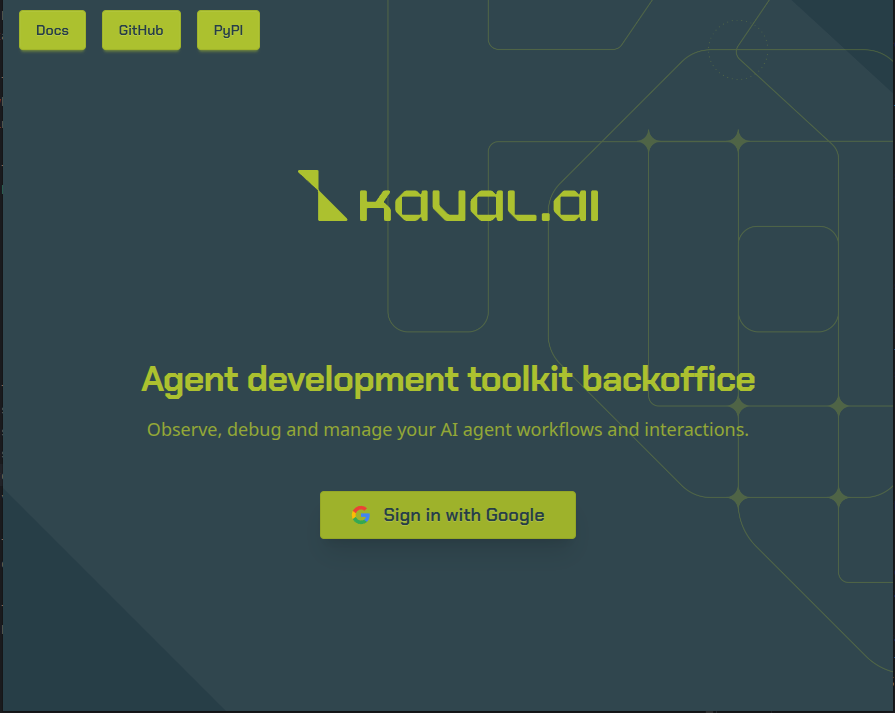
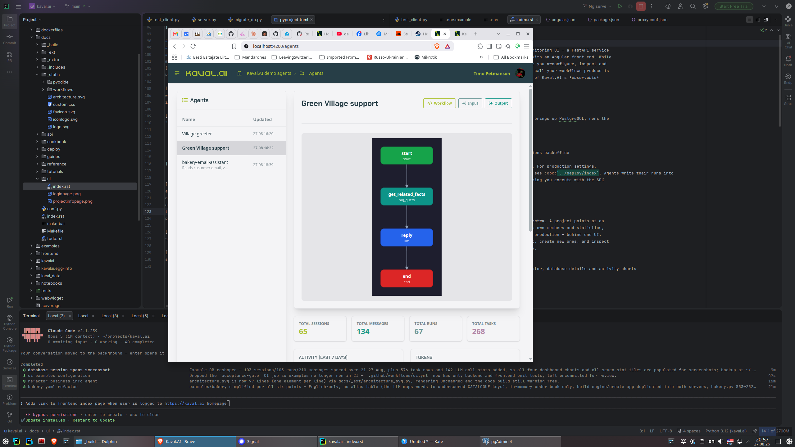
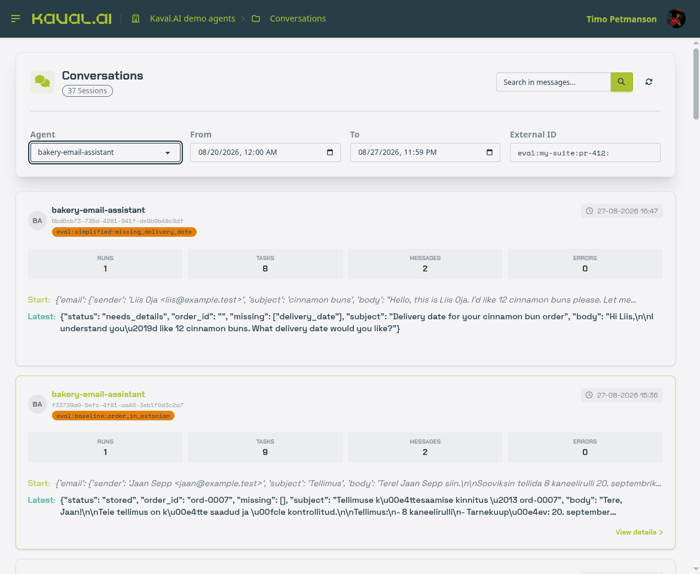
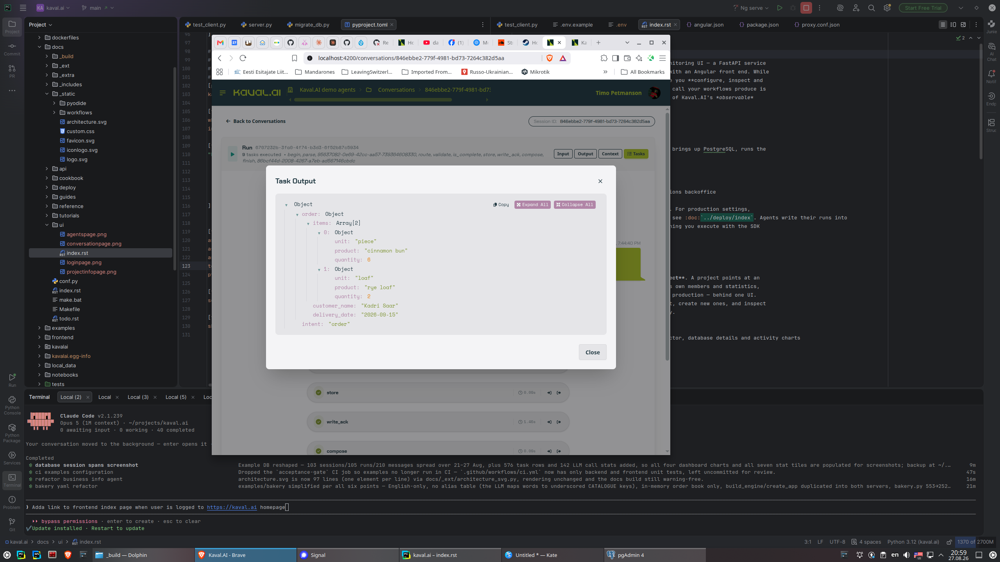
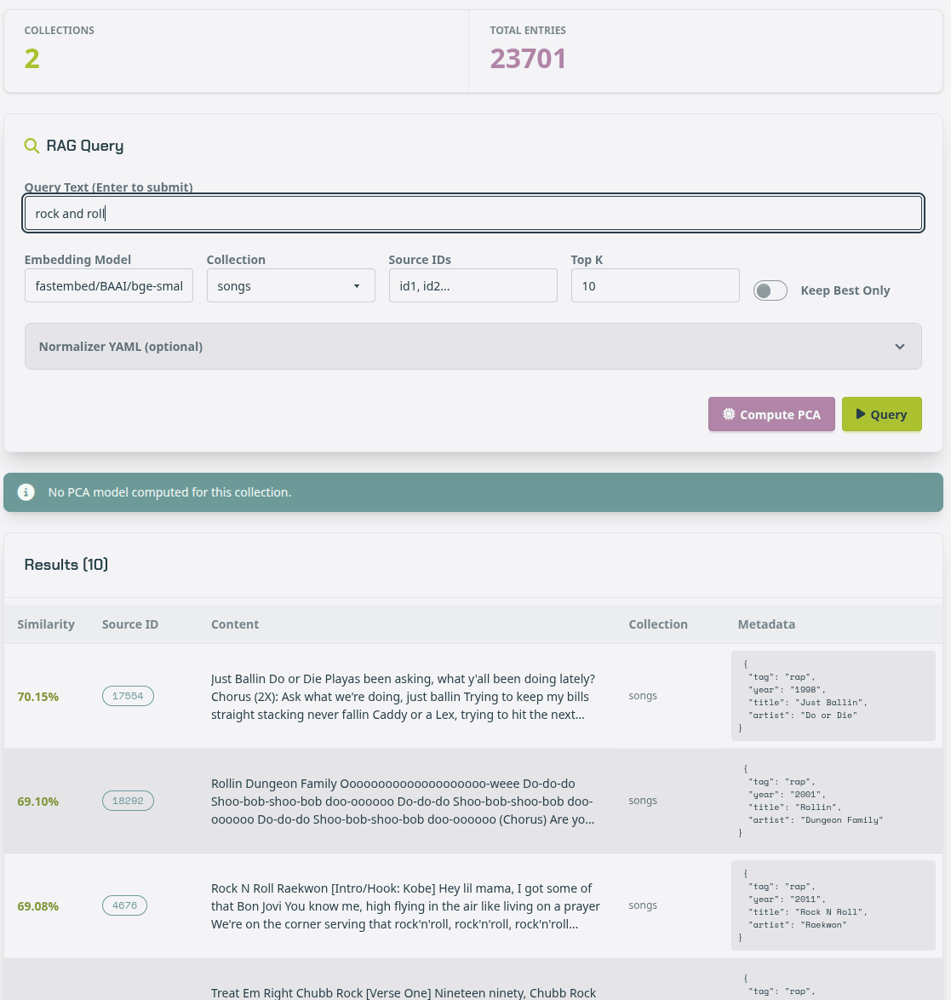
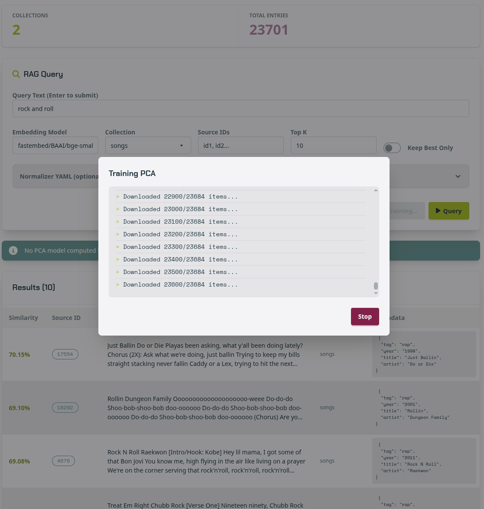
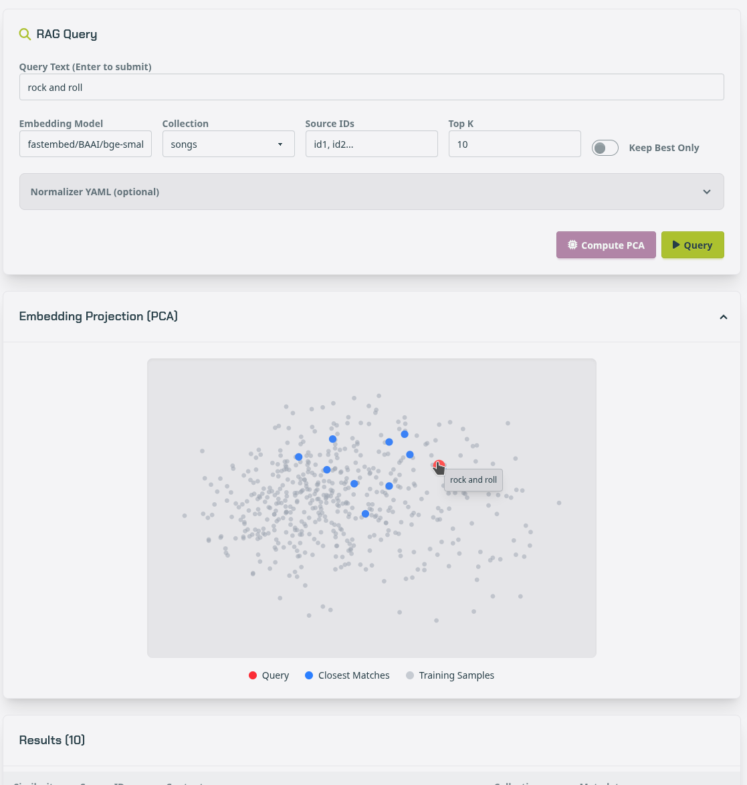

Using the Backoffice UI
=======================

The **backoffice** is Kaval.AI's management and monitoring interface — a FastAPI
service (:mod:`kavalai.backoffice`) backed by PostgreSQL, with an Angular front
end. While the SDK *runs* your agents, the backoffice is where they are
**configured, inspected and observed**: every session, run, node and model call
a workflow produces is recorded and browsable here. It is the visual side of
Kaval.AI's *observable* pillar.

The backoffice reads two databases, and never the same one twice. Its own
schema holds projects, users and memberships; each **project** it manages points
at an *agent* database, which is where the runtime writes. The separation is
deliberate: an agent database can be handed to the backoffice read-mostly, and
several environments — local, staging, production — can be inspected from one
interface without their runtime data ever meeting.

.. contents:: On this page
   :local:
   :depth: 1

Running the backoffice
----------------------

Three things must exist before the interface is usable: a PostgreSQL instance
carrying both schemas, a Google OAuth client for sign-in, and one user row to
sign in as. They are treated in that order below.

Setting up PostgreSQL
^^^^^^^^^^^^^^^^^^^^^

The repository's ``docker-compose.yml`` provides an instance with the
``pgvector`` extension already present, which the RAG tables require:

.. code-block:: bash

   docker compose up -d postgres_db

It exposes PostgreSQL on host port ``6543`` with the development credentials
``kavalai_dev`` / ``kavalai_dev`` and a database of the same name, storing its
data under ``local_data/pgdata``.

An existing PostgreSQL server (version 13 or later) serves equally well. Only a
database and a role permitted to create an extension are needed:

.. code-block:: sql

   CREATE DATABASE kavalai;

Then, connected to that database:

.. code-block:: sql

   CREATE EXTENSION IF NOT EXISTS vector;

The schemas themselves need not be created by hand. Each migration set issues
``CREATE SCHEMA IF NOT EXISTS`` for its target before it runs, and the agents
set creates the ``vector`` extension as its first revision:

.. code-block:: bash

   # The backoffice's own tables: projects, users, memberships, caches.
   python -m kavalai.migrate_db backoffice

   # The agent runtime tables the backoffice reads: sessions, runs, tasks,
   # model call statistics. The RAG tables are provisioned by the RAG
   # service itself on first use.
   python -m kavalai.migrate_db agents

Both are idempotent and both read their connection from the environment —
``KAVALAI_BO_DB_URI`` / ``KAVALAI_BO_DB_SCHEMA`` for the first,
``KAVALAI_DB_URI`` / ``KAVALAI_DB_SCHEMA`` for the second. The two schemas may
share one instance, as they do in the development stack, or live on entirely
separate servers. Every variable is listed in :doc:`../reference/config`, and
the production arrangement in :doc:`../deploy/index`.

Configuring sign-in
^^^^^^^^^^^^^^^^^^^

Authentication is delegated to Google OAuth; the backoffice stores no
passwords. Create an OAuth client in the Google Cloud console, register
``{backoffice}/auth/google/callback`` as its authorised redirect URI, and set:

.. code-block:: bash

   KAVALAI_BO_GOOGLE_CLIENT_ID=...
   KAVALAI_BO_GOOGLE_CLIENT_SECRET=...

   # Signs the session cookie. Required: there is no development fallback.
   KAVALAI_BO_SESSION_SECRET_KEY=...

   # Where a completed sign-in is redirected to.
   KAVALAI_BO_FRONTEND_URL=http://localhost:8000

Starting the service
^^^^^^^^^^^^^^^^^^^^

The development stack builds the image, applies the backoffice migrations and
serves the interface — API and compiled front end together — at
``http://localhost:8000``:

.. code-block:: bash

   docker compose up postgres_db backoffice-migrations backoffice

To run it from a checkout instead, start the API and the Angular development
server separately. The API binds to ``KAVALAI_BO_HOST`` / ``KAVALAI_BO_PORT``,
and the front end proxies to it, so ``KAVALAI_BO_FRONTEND_URL`` must then name
the Angular port:

.. code-block:: bash

   python -m kavalai.backoffice.server      # API, port 8000 unless set
   cd frontend && npm start                 # UI on http://localhost:4200

Signing in
^^^^^^^^^^

The landing page offers a single action.

Creating the first user
^^^^^^^^^^^^^^^^^^^^^^^

Sign-in authenticates an identity; it does not grant one. A Google account is
admitted only if its address already appears in the ``users`` table — an
unknown address is refused with ``403 User not registered in the system`` and
the attempt is logged. Nothing self-registers, which is why an installation
that has just been migrated cannot yet be entered by anyone.

The first user is therefore inserted by hand, once, directly into the
backoffice schema. Make it an administrator: only administrators may create
projects and further users.

.. code-block:: sql

   INSERT INTO backoffice.users (id, email, name, is_admin, created_at, updated_at)
   VALUES (gen_random_uuid(), 'you@example.com', 'Your Name', true, now(), now());

The address must match the Google account exactly; ``name`` and ``picture`` are
overwritten from the Google profile on every sign-in, so their initial values
matter little. Against the development stack the statement can be applied with:

.. code-block:: bash

   docker compose exec postgres_db \
     psql -U kavalai_dev -d kavalai_dev -c "INSERT INTO backoffice.users \
     (id, email, name, is_admin, created_at, updated_at) VALUES \
     (gen_random_uuid(), 'you@example.com', 'Your Name', true, now(), now());"

This is the only step that requires database access. Once that account can sign
in, every further user is added from the **Users** page and every project from
the interface itself.

Projects
--------

Everything in the backoffice is scoped to a **project**. A project carries a
name, a description, the connection details of its agent database — host, port,
user, password, database and schema — its members, and a cache in which derived
artefacts such as trained PCA models are kept. The project page is where the
active project is chosen, new ones are created, and the connection is verified.

.. image:: projectinfopage.png
   :alt: Project page with the active-project selector, database access details
         and seven-day activity and token charts
   :width: 100%

The **Statistics (Last 7 Days)** panels are read from the agent database rather
than from the backoffice's own: sessions, messages, tasks and workflow runs on
the left, input, output and embedding tokens on the right. They are the first
indication that a project's connection is sound and that the runtime is in fact
writing to the schema the project names.

The selected project follows the user across pages, and is stored as
``active_project_id``. If the project is later deleted, or the membership
revoked, that value is re-resolved on the next page load rather than left to
answer ``403`` — a session that goes stale repairs itself without a re-login.

Agents
------

The **Agents** page lists the agents that have written to the active project's
database. Selecting one renders its workflow as a graph — the same renderer the
documentation uses, so the picture in the interface and the picture in
:doc:`../tutorials/workflow` are produced by one code path — alongside the
declared **Input** and **Output** models and the agent's headline counters.

         graph, with total sessions, messages, runs and tasks beneath it
   :width: 100%

The graph is the workflow as the engine parsed it, not as it was written: node
names carry their type beneath them — ``rag_query``, ``llm``, ``start``,
``end`` — so a definition can be checked against what is actually being served.

The counters below it (total sessions, messages, runs and tasks) and the
seven-day charts describe one agent rather than the whole project, which makes
this the quickest view for judging how heavily a single agent is used.

Workflow monitoring
-------------------

The **Workflows** page is a monitoring timeline: one row per agent, one marker
per recent run. Completed runs are filled and empty runs are flagged, which
gives an at-a-glance health view across every agent in the project and a route
into any individual run.

Conversations
-------------

A **conversation** is a session: the runs triggered within it, the messages
exchanged, and the errors raised. The list is filtered by agent, by date range,
and by external identifier — the last of these is how evaluation runs are found,
since :doc:`../guides/evaluation` records each case under
``eval:{tag}:{case}``.

         run, task, message and error counts with the first and latest payloads
   :width: 100%

Each entry shows the counts for that session and, below them, its first and
latest payloads. Because a Kaval.AI workflow's boundaries are typed, those
payloads are structured data rather than prose: in the illustration the bakery
assistant's latest output carries ``status``, ``order_id`` and ``missing``
beside the human-readable ``subject`` and ``body``, so what the workflow decided
is legible without reading what it wrote.

The task debugger
-----------------

Opening a conversation descends one further level, to the runs it contains and
the tasks each run executed. A run names its nodes in execution order, and every
node can be opened on its own.

         output opened in an expandable JSON viewer
   :width: 100%

Each task records its duration and its status, and exposes the value that
entered it and the value that left it. The output opens in an expandable
viewer: here the ``parse`` node's result is the order it extracted from a
customer's email — two items with product, quantity and unit, a customer name, a
delivery date and the intent it classified. The **Input**, **Output** and
**Context** buttons at run level show the same for the run as a whole.

This is the intended way to answer "why did it do that": each node's own input
and output are stored, so a wrong answer can be traced to the step that first
went wrong rather than inferred from the final reply. The rows come from the
task-logger backend described in :doc:`../guides/observability`, and are
written only when a workflow is run with one configured.

Model calls
-----------

The **Model calls** page lists every LLM and embedding call the runtime made:
provider and model, status, duration, prompt and completion tokens — cached
prompt and reasoning tokens among them — and the request and response payloads.
Each row is a :class:`~kavalai.ModelCallStat`. There is no cost column, and
deliberately so: providers report tokens rather than money, and cached input is
priced differently enough that a derived total would be wrong rather than
merely stale.

RAG explorer
------------

The **RAG** page is the interface's answer to a question the SDK can only
answer in a notebook: what is actually in this index, and does it retrieve what
one would expect? It reads the project's vector collections directly through
:class:`~kavalai.rag.PostgresRagService`, so it needs no agent, no workflow and
no running server — only a project whose database holds an index.

         showing similarity, source ID, content, collection and metadata
   :width: 100%

Two counters head the page — the number of collections in the schema and the
total number of indexed entries across them. Beneath them sits the query form,
whose controls correspond one for one to the arguments of
:meth:`~kavalai.rag.BaseRagService.query`:

.. list-table::
   :header-rows: 1
   :widths: 22 78

   * - Control
     - Effect
   * - **Query Text**
     - The text to embed and search with. Pressing *Enter* submits it.
   * - **Embedding Model**
     - The ``provider/model`` identifier the query is embedded with. It must be
       the model the collection was indexed with; a different model yields a
       different vector space, and therefore meaningless neighbours.
   * - **Collection**
     - Which collection to search. Collections are the unit of separation
       within one schema.
   * - **Source IDs**
     - Restricts the search to given source identifiers — the way to ask what a
       specific document contains rather than what the corpus does.
   * - **Top K**
     - How many neighbours to return.
   * - **Keep Best Only**
     - Collapses the chunks of a single document to its best-scoring chunk, so
       that a long document cannot occupy every result slot.
   * - **Normalizer YAML**
     - An optional normalisation specification applied to the query text before
       it is embedded. It exists so that a query can be normalised exactly as
       the corpus was at indexing time.

Results are returned ranked by **similarity**, reported as
higher-is-better cosine similarity (``1 - distance``) on every backend, so the
figures are comparable across storage engines. Each row carries its source
identifier, the retrieved content, its collection, and the metadata it was
indexed with — the same ``rag_metadata`` a
:class:`~kavalai.rag.RagServiceResult` exposes to a workflow. Reading a
retrieval failure off this table is usually immediate: either the intended
passage is absent from the index, or it is present and ranked below something
else.

Projecting the embedding space
^^^^^^^^^^^^^^^^^^^^^^^^^^^^^^

Similarity figures say how close a match is; they do not say what the
neighbourhood looks like. **Compute PCA** fits a two-dimensional projection of
the collection so that it can be seen.

Training streams its progress over Server-Sent Events and can be stopped from
the dialog. The embeddings are exported from the collection, an incremental PCA
is fitted over them in batches, and both the fitted model and a sample of 500
projected points are stored in the project's cache. The work is done once per
collection: subsequent queries reuse the stored model, and a page whose
collection has no model yet says so plainly rather than showing an empty plot.

         matches in blue and the cached training sample in grey
   :width: 100%

The projection then accompanies every query against that collection. The
cached sample is drawn in grey as the shape of the corpus, the query in red,
and its nearest neighbours in blue; hovering a point reveals what it is. Two
components of a many-hundred-dimensional space are a lossy summary and should
be read as one — but they answer questions a ranked list cannot. Whether the
retrieved matches form a cluster or are scattered, whether the query falls
inside the corpus or at its edge, and whether a collection is one body of text
or several, are all visible at a glance. A query that lands far from every grey
point is a query the index was never built to answer, and the similarity
figures beneath it should be read in that light.

Users and access
----------------

The **Users** page is administrator-only. It is where accounts are created
after the first — an address and a name, with the administrator flag granted or
withheld — and where they are removed. An administrator cannot delete their own
account, which prevents an installation from being locked out of itself.

Membership is granted per project, in one of two roles. A **viewer** may read
everything the project exposes; an **owner** may in addition edit the project,
manage its members and delete it. The last owner of a project can be neither
removed nor demoted, so a project cannot be orphaned. Every project-scoped
endpoint verifies membership on the server, so the interface hides only what
the API would refuse in any case.
